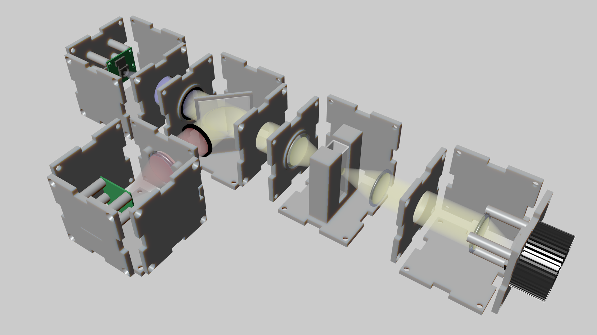

---
---



## Viewer
<div id = "viewerContainer">
</div>

## Getting started

1. Download and install OpenSCAD. You can get the latest version from the official [website](http://www.openscad.org).

2. Download the uCube library.

3. Open OpenSCAD, create a new file and include the uCube library by typing

```javascript
include <uCube.scad>
```

4. You can create a uCube model by typing

```javascript
uCube();
```
5. Hit Render(F6) button. After the rendering is finished, you should see a uCube model ready for export.

6. Press Export as STL button, and send the file for 3D printing.

7. Erase the `uCube();` command and type the following instead:

```javascript
myLens = Lens(f = 25, r = 12.5, minH = 2, maxH = 5);
myAperture = Aperture( shape="circle", size = [10, 10] );
uLensFaceI( lens = myLens, aperture = myAperture, supportH = 5 );
```

The first line creates a new instance of a `Lens` class with a given parameters. The second line creates an instance of a circular `Aperture` with a 10 mm radius. The third line creates a uFace, with the given aperture, and support for the myLense, positioned 5 mm above the uFace.

### Assembly

Please check out the [DocuBricks](http://www.docubricks.com/projects/ucube) portal for the assembly instructions.

### Library of parts

Please check out the part collection [here](https://github.com/mdelmans/uCube/wiki).

### Example projects at Hackster.io

[uCameraCube](https://www.hackster.io/delmans/ucameracube)

[uLightCube](https://www.hackster.io/delmans/ulightcube)

### Publication
...


